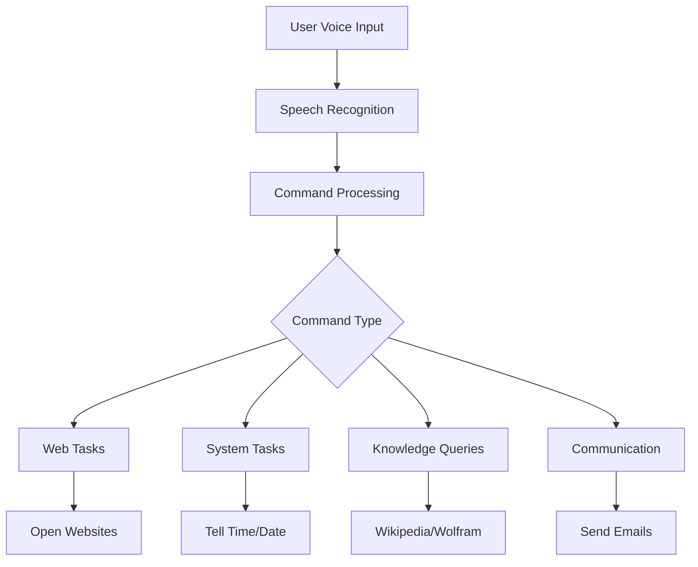

# 🎙️ Python Voice Assistant

  
*A smart virtual assistant that responds to voice commands for automating daily tasks*

## 🌟 Features
- **Voice Interaction**: Natural voice commands
- **Multi-functional**: 20+ commands
- **Smart Integrations**: APIs for weather, knowledge, email
- **Cross-platform**: Works on Windows, Mac, Linux

## 📊 System Architecture


## 🛠️ Tech Stack
| Component       | Technology Used |
|----------------|----------------|
| Speech-to-Text | `speech_recognition` |
| Text-to-Speech | `pyttsx3` |
| Knowledge Engine | `wikipedia` + `wolframalpha` |
| Weather Data | OpenWeatherMap API |
| Email Service | Gmail SMTP |

## 🚀 Getting Started

### Prerequisites
- Python 3.8+
- Microphone
- Internet connection

### Installation
```bash
# Clone repository
git clone https://github.com/yourusername/voice-assistant.git
cd voice-assistant

# Create virtual environment
python -m venv venv
source venv/bin/activate  # Linux/Mac
venv\Scripts\activate  # Windows

# Install dependencies
pip install -r requirements.txt

# Set up environment variables
cp .env.example .env
```

### Configuration
Edit `.env` file:
```ini
EMAIL_USER=your@gmail.com
EMAIL_PASS=your_app_password
WEATHER_API_KEY=your_openweather_key
WOLFRAM_APP_ID=your_wolfram_id
```

## 🗣️ Available Commands
| Category       | Example Commands |
|---------------|------------------|
| **Basic**     | "What time is it?", "Tell me a joke" |
| **Web**       | "Open youtube", "Open github" |
| **Knowledge** | "Wikipedia AI", "Calculate 45*89" |
| **Weather**   | "Weather in London", "Is it raining?" |
| **Email**     | "Send email" (follow prompts) |
| **System**    | "Shutdown computer" |

## 📸 Screenshots
<div align="center">
  
  
</div>

## 🛠️ Troubleshooting
| Issue | Solution |
|-------|----------|
| Mic not working | Check system permissions |
| API errors | Verify .env keys |
| Slow response | Reduce background noise |

## 🤝 Contributing
1. Fork the project
2. Create your feature branch (`git checkout -b feature/AmazingFeature`)
3. Commit changes (`git commit -m 'Add amazing feature'`)
4. Push to branch (`git push origin feature/AmazingFeature`)
5. Open Pull Request

## 📜 License
MIT License - See [LICENSE](LICENSE) for details

## ✉️ Contact
Your Name - your.email@example.com  
Project Link: [https://github.com/yourusername/voice-assistant](https://github.com/yourusername/voice-assistant)
```

